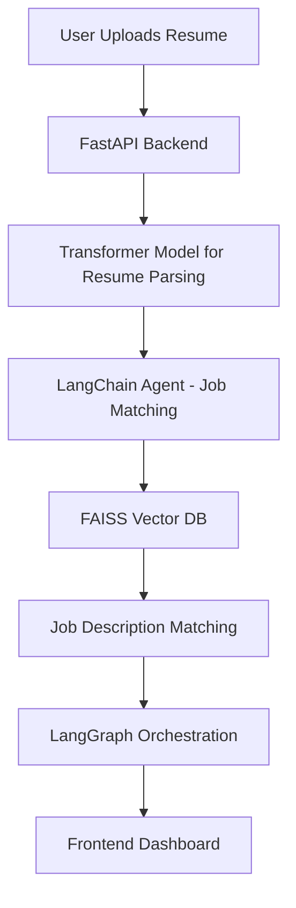

# AI-Powered Resume Analyzer & Job Matcher 🚀

## Overview
This project is an **AI-driven Resume Analyzer and Job Matcher** built with a **heavy ML + Agentic AI stack**.  
It leverages **Transformers, LangChain, LlamaIndex, FAISS, and agentic reasoning** to provide deep insights into resumes, skill matching, and personalized recommendations.

Unlike simple API-based implementations, this system uses **end-to-end ML pipelines** and **agent-based architectures** for robust, scalable, and production-grade performance.

---

## ✨ Features
- 📄 **Resume Parsing & Understanding** → Extracts entities, skills, and experience from resumes using **Transformer-based NLP models (BERT, RoBERTa, DistilBERT)**.
- 🧠 **Intelligent Job Matching** → Matches resumes to job descriptions using **FAISS vector similarity search**.
- 🤖 **Agentic AI** → Powered by **LangChain + LangGraph agents** to perform reasoning, knowledge retrieval, and workflow orchestration.
- 🔍 **Semantic Search** → Uses **Sentence Transformers** to embed resumes and job descriptions for contextual similarity.
- 📊 **Analytics Dashboard** → Provides skill-gap analysis, job fit scoring, and growth recommendations.
- ⚡ **Backend in Python** with **FastAPI** for API handling and ML pipeline integration.
- 🗂 **Database**: PostgreSQL + FAISS (for vector search).
- 📹 **Live Demo Integration**: Supports uploading resumes, generating insights, and providing AI-powered suggestions in real-time.

---

## 🏗️ Tech Stack

### 🔹 Backend
- **Python 3.12**
- **FastAPI** (high-performance async backend)
- **LangChain** (agentic AI workflows)
- **LangGraph** (graph-based agent orchestration)
- **Transformers (Hugging Face)** (BERT, RoBERTa, DistilBERT, GPT variants)
- **SentenceTransformers** (for embeddings)
- **FAISS-CPU** (vector database for similarity search)
- **PostgreSQL** (structured data storage)
- **Pandas, NumPy** (data processing)

### 🔹 Frontend
- **React.js** (modern UI framework)
- **TailwindCSS** (styling)
- **Redux Toolkit** (state management)
- **WebSockets** (real-time updates)

### 🔹 ML & AI
- **Transformer Models**: BERT, RoBERTa, DistilBERT for NER + embeddings  
- **Sentence Transformers** for semantic similarity  
- **FAISS** for high-performance similarity search  
- **Agentic AI with LangChain + LangGraph** for reasoning and orchestration  
- **ML Algorithms Used**:  
  - Logistic Regression & Random Forests (for baseline classification)  
  - Transformer-based Embedding Similarity (deep semantic matching)  
  - KMeans (for clustering skill sets)  

---

## ⚙️ Architecture

---

## 🚀 How It Works
1. User uploads a **resume (PDF/DOCX)**.  
2. Resume is parsed → **entities, skills, experiences** extracted.  
3. Embeddings are generated using **Sentence Transformers**.  
4. Embeddings stored + compared in **FAISS Vector DB**.  
5. **LangChain + LangGraph agents** reason over job database.  
6. **Recommendations & Analytics** displayed in dashboard.  

---

## 📦 Installation

```bash
# Clone repo
git clone https://github.com/your-username/ai-resume-analyzer.git
cd ai-resume-analyzer

# Create virtual environment
python -m venv venv
source venv/bin/activate  # On Windows: venv\Scripts\activate

# Install dependencies
pip install -r requirements.txt

# Run backend
uvicorn app.main:app --reload

# Run frontend
cd frontend
npm install
npm run dev
```

---

## 📊 Example Output
- **Resume Score**: 87/100  
- **Top Skills Matched**: Python, Machine Learning, FastAPI  
- **Missing Skills**: Docker, Kubernetes  
- **Suggested Jobs**: Data Scientist @ CompanyX, ML Engineer @ StartupY  

---

## 📘 Future Enhancements
- Add **multi-modal analysis** (text + video resumes).  
- Integration with **LLM-powered interview bots**.  
- **Explainable AI** for resume scoring.  
- Cloud deployment with **Kubernetes + AWS/GCP**.  

---

## 👨‍💻 Contributors
- Built by **Ankit Kumar**  
- AI/ML Backend with Transformers & LangChain  
- Frontend with React + Tailwind  

---

## 📜 License
MIT License

